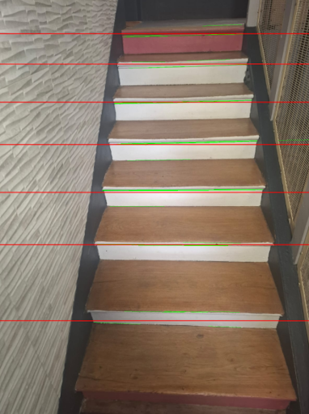
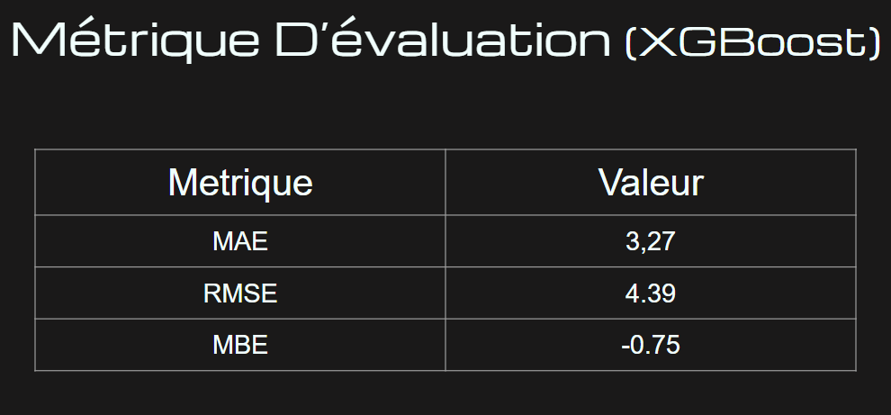

# Projet Image - Détection des Escaliers

## Auteurs
- **Wassim CHIKHI**
- **Mohamed MEKKAOUI**
- **Ahlem LABRI**

## Description du Projet
Le projet vise à développer un modèle de prédiction pour détecter le nombre d'escaliers présents dans des images. L'objectif est d'utiliser diverses techniques d'apprentissage automatique et d'algorithmes de traitement d'image pour prédire le nombre d'escaliers à partir d'images d'escalier.

### Algorithmes utilisés :
- **Transformation de Hough** pour la détection des lignes dans les images.
- **SVR (Support Vector Regression)**, **Random Forest**, **Gradient Boosting**, **XGBoost**, et **Réseaux de Neurones** pour la prédiction des résultats.

## Installation

### Pré-requis
Vous devez installer les bibliothèques suivantes :
- Python 3.10 (Minimum)
- OpenCV
- scikit-learn
- torch (pour les réseaux de neurones)
- matplotlib
- numpy
- pandas
- xgboost
- skimage

Utilisez `pip` pour installer les dépendances nécessaires :

```bash
pip install opencv-python scikit-learn torch matplotlib numpy pandas xgboost scikit-image
```

### Structure du Projet
```
/Projet_Escaliers
│
├── data/                    # Contient les images pour l'entraînement du modèle
│
├── notebook/                # Contient les notebooks avec le code d'entraînement, de test et de prédiction
│
├── results/                 # Dossier pour enregistrer les résultats et les images traitées
│
└── README.md                       
```

## Résumé du Modèle

### Prétraitement des Données
Les données sont regroupées en plusieurs groupes d'images avec des extensions spécifiques. Chaque image est convertie en un vecteur de caractéristiques à l'aide de diverses techniques de filtrage d'images, telles que la détection de bords avec Canny, les filtres Sobel, et les transformations bilatérales. 

Les caractéristiques extraites sont ensuite normalisées à l'aide de **StandardScaler**, **PowerTransformer** ou **RobustScaler**.

### Modèles Entraînés
- **Régression SVR**
- **Random Forest**
- **Gradient Boosting**
- **XGBoost**
- **Réseaux de Neurones Profonds**

Le modèle de régression le plus performant a été sélectionné en fonction de l'erreur absolue moyenne.

## Évaluation du Modèle

### Métriques
Les performances du modèle sont évaluées avec les métriques suivantes :
- **Erreur Absolue Moyenne (MAE)**
- **Erreur Quadratique Moyenne (MSE)**
- **Erreur Quadratique Moyenne de la Racine (RMSE)**

Les évaluations des différents modèles, y compris les réseaux de neurones, sont enregistrées dans des fichiers logs pour chaque paramètre testé. Les résultats incluent l'erreur de prédiction par modèle et par jeu de données.

### Résultats
Les résultats des prédictions sur les images sont affichés en temps réel, avec un comptage des escaliers détectés. Les images avec les résultats sont sauvegardées dans le dossier `results/`.

Exemple de sortie :

```
Nombre d'escaliers détectés : 9
```

### Illustration des Résultats
Vous pouvez ajouter une illustration pour visualiser les résultats de la détection. Par exemple :



## Perspective
Une amélioration future possible pour ce projet est d'intégrer un modèle de segmentation basé sur YOLO pour isoler uniquement les escaliers dans l'image, ce qui pourrait améliorer encore la précision de la détection.

### Images Renommées
Le renommage des images dans chaque groupe a été effectué afin de garantir un ordre chronologique et une gestion claire des données.



### Fonctionnalités
- Prédiction du nombre d'escaliers à partir d'une image d'entrée.
- Tests avec plusieurs types de filtres d'image et d'algorithmes de machine learning.

---

**Note:** Vous pouvez ajouter des exemples plus détaillés et des illustrations spécifiques pour chaque évaluation des modèles dans cette section.

## Contribuer
Les contributions sont les bienvenues ! Si vous souhaitez améliorer ce projet, n'hésitez pas à forker ce repository et à soumettre une pull request.

